# Uploadea   
 > Secure Files Storage & Sharing Platform

Simple & Powerful Uploadea is Amazingly easy to Use where to Store Your Data & Save Your Countless Time.

Uploadea cloud storage software provides online Data file Sync for Free and Paid Version. At Uploadea, Cloud Storage Backup is unlimited and Data Disaster Recovery.

# Abstruct
Over the years, we have consistently needed to run software programs without installing them on our PCs; store and access our media content employing the web; create and test programs without fundamentally having servers and the need goes on. Presently, the 21st century saw a breakthrough with the introduction of cloud storage. Uploadea Hot Cloud storage is by a wide margin the most commended specialized innovation in the 21st century because not long before its emergence it took to the mainstream and it is been used not only by average individuals but also big businesses and organizations. Energized by a single framework designed for data synchronization, Uploadea is designed to facilitate efficient and realtime information exchange.  
From Experience and numerous researches, we have seen that nothing is more frustrating than when your credit cards get declined while trying to make online transactions. It could be that your credit card doesn't work in foreign countries. Also, we have seen cases where the pieces of information on your credit card are used to rid you of your money. Furthermore, we have seen that most people are very skeptical when it comes to making online payments using their credit cards and the buying process may not be successful. For this reason, we seek to solve this problem with the introduction of the Uploadea Token.  
With the introduction of the Uploadea Token, the process of making payments to our services will be seamless, fast, and secure.

# LEGAL DISCLAIMER
Legal Disclaimer It is requested to read this legal disclaimer section with full attention. In case of any doubt, the consultancy should be taken from the legal, financial, tax, or another professional law practitioner. All the items of information that have been given below are not to be given in an exhaustive way and they can never be considered a part of various contractual relationships. It is our utmost desire that the information given in this white paper should be accurate, up to date, and all the products, services, technical architecture, token distribution, and company timelines. Moreover, these materials could have changed without any notice and they can never be considered a binding agreement of the professional advice. This white paper does not bound any individual to enter into any contract or enter into any binding legal commitment to the contribution. This white paper also does not constitute any form or any part of any opinion which can be considered advice, or which can sell, or which can solicit any offer to purchase nor invest, nor shall it be considered a part of any effect which can be used for the formation of contract or investment decision. This white paper also does not have any capacity to bind any person to enter into any contract or consider it a binding legal commitment to the contribution of the whitepaper. Even no sales and even no cryptocurrency or any other form of any payment can never be accepted based on this white paper. Although the participation eligibility has not been finalized yet it can announce very clearly that the eligibility in this blockchain future sales events may vary from country to country and from different citizenships to different citizenships and from different resident ships to resident ships. But be sure that any advancement or any date or any new information of this token will be made available for the private and public contributors. It is also announced that the white paper has not been examined by any regulatory authority and it has not been approved by any legal firm so the information given in this white paper cannot be taken under the laws or any regulatory authority or under any rules of any jurisdiction. It is hereby announced that its publication, its distribution, its dissemination do not imply the applicable laws, the regulatory requirements, and the available rules.

Table of Contents
=================

  * [ABSTRACT](#abstruct)
  * [LEGAL DISCLAIMER](#legal-disclaimer)
  * [INTRODUCTION](#introduction)
  * [WHAT IS UPLOADEA ?](#what-is-uploadea)
  * [WHAT IS UPL TOKEN ?](#what-is-upl-token)
  * [WHY TO CHOOSE UPLOADEA ?](#why-to-choose-uploadea)
    * [end-to-end encryption system](#end-to-end-encryption-system)
    * [Social control](#social-control)
    * [Data backup](#data-backup)
    * [File Metadata substructure](#file-metadata-substructure)
    * [Root code originality](#root-page-originality)
 * [Distinctive Features of UPLOADEA](#distinctive-features-of-uploadea)
    * [Efficiency](#efficiency)
    * [Availability](#availability)
    * [Disaster recovery](#disaster-recovery)
    * [Scalability](#scalability)
    * [Cloud options](#cloud-options)
    * [Strategic edge Enhanced productivity](#strategic-edge-enhanced-productivity)
    * [Computerized software updates](#computerized-software-updates)
    * [Competitiveness](#competitiveness)
    * [Enhanced collaboration](#enhanced-collaboration)
  * [TOKENOMICS](#tokenomics)
  * [WHY TO CHOOSE UPL TOKEN?](#why-to-choose-upl-token)
    * [Decentralized platform of UPL](#decentralized-platform-of-upl)
    * [Full Transparency of UPL Token](#full-transparency-of-upl-token)
    * [Fast and Secure](#fast-and-secure)
    * [Multipurpose Utility of UPL Token](#multipurpose-utility-of-upl-token)
    * [Maximum Buying Limit](#maximum-buying-limit)
    * [The Logic of Token Burning](#the-logic-of-token-burning)
  * [NOTABLE FEATURE OF UPL TOKEN](#notable-feature-of-upl-token)
    * [Javawallet](#javawallet)
    * [Uploadea Visa Card](#uploadea-visa-card)
  * [TOKEN DISTRIBUTION PLAN](#token-distribution-plan)
  * [ROADMAP](#roadmap)
  * [MARKET STRATEGY](#market-strategy)
    * [Website](#website)
    * [Referral Rewards](#referral-rewards)
    * [Branding](#branding)
    * [Partnership](#partnership)
    * [Press Publicity](#press-publicity)
  * [CONCLUSION](#conclusion)

# INTRODUCTION
Cloud storage is a service model in which data is maintained, managed, backed up remotely, and made available to users over a network (typically the Internet). Users generally pay for their cloud data storage on a per-consumption, monthly rate.  
Upload Cloud white papers explain the technology underlying our products and services or examine topics such as security, architecture, and total cost of ownership.

  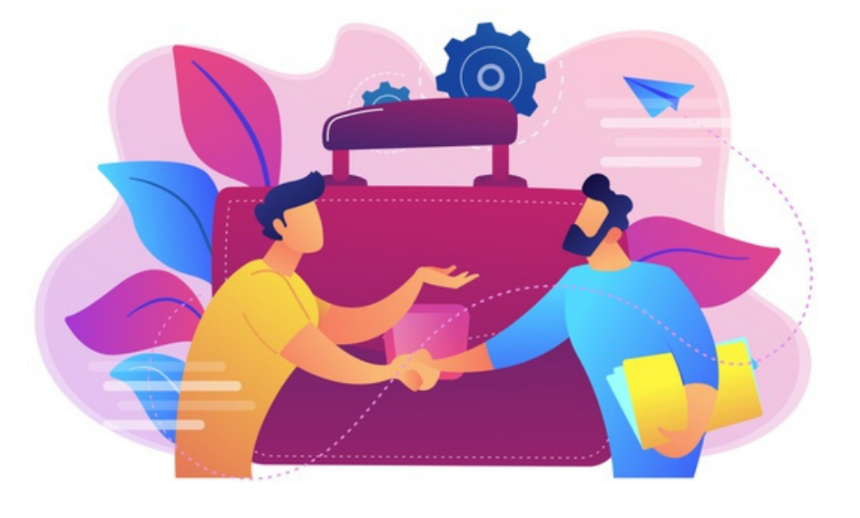

# WHAT IS UPLOADEA ?
Uploadea is Amazingly easy to Use where to Store Your Data & Save Your Countless Time Uploadea cloud storage software provides online Data file Sync for Free and Paid Version. At Uploadea, Cloud Storage Backup is unlimited and Data Disaster Recovery.

  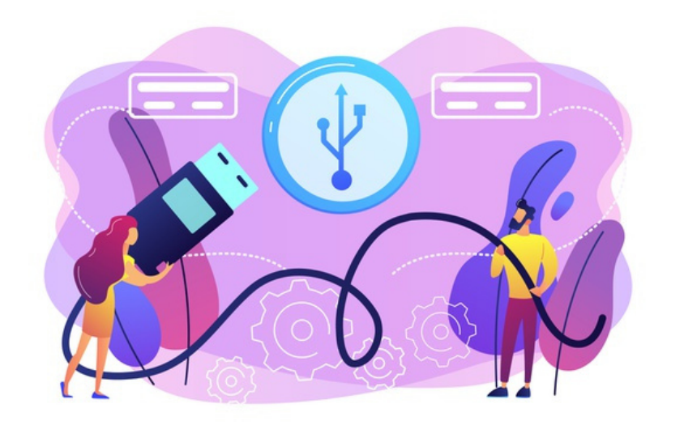

# WHAT IS UPL TOKEN ?
UPL is a decentralized smart token project attached with ERC20 token which is a blockchain-based asset. Here the major difference between the ERC20 blockchain and other cryptocurrencies has been given full consideration by the planners of the project. Ethereum blockchain gets the hosting of these tokens, while on the other hand the bitcoins and other currencies get attached with other blockchains and have their own individual relative capacities of currencies while this type of ERC20 is attached with Ethereum blockchain.  
With the introduction of the UPL Token, the process of making payments to our services will be seamless, fast, and secure.

  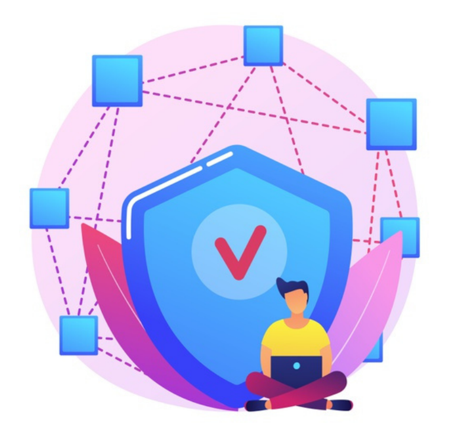

# WHY TO CHOOSE UPLOADEA ?
Uploadea Hot cloud storage offers a very secured, swift, and easy to use cloud storage platform with user-controlled end-to-end encryption (E2EE). Users are provided with a unique encryption key that is not accessible to anyone including UPLOADEA. However, the user may decide to share data (Single information or whole folder), encryption keys with others.  
UPLOADEA is presently the leading cloud storage provider encouraging browser access to end-to-end-encrypted cloud storage. This displaces the obstruction to entry and influences the mass acceptance of encryption.  UPLOADEA cloud storage software enables online Data file Sync for Free and Paid Version. UPLOADEA hot cloud storage offers 50GB of Free storage space.  
At Uploadea, Cloud Storage Backup is unlimited and Data Disaster Recovery

  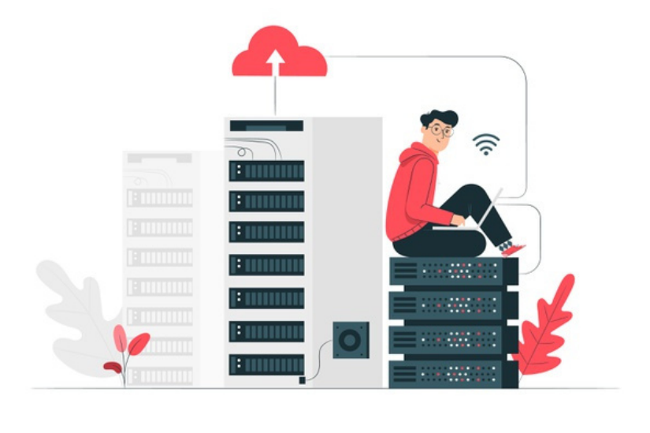

# END-TO-END ENCRYPTION SYSTEM

As files need to be stored securely, UPLOADEA has been fashioned around the client’s proprietary end-to-end encryption. This means that data files, con tents, and audio/video contents are encrypted on the user’s customer device before it gets transferred to the UPLOADEA system. If a client wants to share data with a third party, he encodes the needed encoding keys with the recipi ent’s public key before sending them. To secure the personality of the recipi ent, Security test questions are set in place and any alteration will activate an alert, eradicating the endangerment of imposture by means of a post-confir mation man-in-the-middle attack.

# SOCIAL CONTROL

In other to keep UPLOADEA up and running, UPLOADEA is equipped with an online chatbot where users can address service availability,integrity, security, privacy and confidentiality issues. We are dedicated to meeting up the requirements of our esteemed users.
* UPLOADEA rewards handsomely anyone who notifies us of viable additions that can be put in place to enhance the quality of the user experience. 
* UPLOADEA also rewards any reported issue that may interrupt the cryp tographic security model, permitting illegitimate remote admittance to or ma nipulation of keys or data files. 
* UPLOADEA rewards any reported issue that may bypass admittance control, allowing the unlicensed overwriting/destruction of keys or individual data UPLOADEA rewards any reported issue that may jeopardize the confidentiality of an account’s data in case the associated email address is compromised.

# DATA BACKUP

The storage of a system is tiered by the reliability of that system, because of that, we’ve improved UPLOADEA with multiple layers of redundancy to protect against data loss and ensure accessibility.
* UPLOADEA possesses and controls its server system seamlessly and does not depend on any third-party VPS suppliers, which is advantageous in the era of CPU sidechannel attacks (“Spectre”). 
* UPLOADEA have a secured Datacenter in Boston and plans on expanding and owning data center in Germany, India, Netherlands, and the USA. UPLOADEA has several classes of substructure, each with its redundancy and data integrity security mechanisms.

# FILE METADATA SUBSTRUCTURE

Specific essential information about user data, termed metadata, is stored in its discrete storage service and serves as a record for the data in users’ accounts. Metadata comprises primary account and user information, like device names, email addresses, and names. Metadata also incorporates Essen trial information about files, including file names and types, that assist support features like version history, recovery, and sync. Modification of code to the API substructure (this action permits UPLOADEA users to “address” the database
Assemblies) is accomplished through strict operations with different stages of code revaluation by various key UPLOADEA administrative members to preserve the integrity of the database clusters.  
Duplicated copies of file metadata are dispersed across selfreliant repositories within a data center in at least an N+2 accessibility model. Additive backups are carried out by the hour, and complete backups are performed every three days.

# ROOT CODE ORIGINALITY
UPLOADEA renders transparency of the genuine enforcement by publishing the full and up-to-date root code of all its client history. All cryptographic dealings related to the safety of the clients’ data take place entirely on their own devices. Allowing all concerned third parties to severally confirm whether UP LOADEA’s assertion is genuine, whether the enforcement is right and that there are no loopholes or accidental exposure to danger. Clients are permitted to use the root code for research purposes and to build the user’s apps straight from the scratch.

  

# DISTINCTIVE FEATURES OF UPLOADEA

## EFFICIENCY
Business transactions are done efficiently when there are mutual understanding and trust between both parties.

  

## AVAILABILITY:
UPLOADEA Cloud computing and storage are dedicated to facilitating the use of applications and data from any destination globally and any device with web access.

  

## DISASTER RECOVERY:
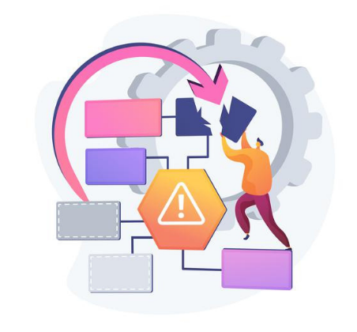
UPLOADEA Cloud computing and storage are set to offer the most efficient means for small, medium, and even large enterprises to backup and restore their data and applications in a fast and reliable way. Whitepaper uploadea.com 13 Our Mission Flexibility Flexibility is obtained in subsequent procedures when using UPLOADEA hot cloud computing

## SCALABILITY:

UPLOADEA Cloud computing is set to be the most suitable choice for companies with varying workloads since our cloud support scales depend on the needs of the company. Tools choice: UPLOADEA Cloud computing is set to permit businesses to pick special prebuilt instruments and features to obtain answers tailored to their special demands.

## CLOUD OPTIONS:

UPLOADEA Cloud computing is set to offer special cloud, public cloud, and hybrid cloud answers separately with various features. Businesses can select these choices depending on what adequately serves their demand. Control choices: UPLOADEA offers Businesses complete admittance to decide their level of command with as-a-service benefits offered by the UPLOADEA cloud provider. These choices include SaaS, PaaS, and IaaS.

## STRATEGIC EDGE ENHANCED PRODUCTIVITY:

UPLOADEA Cloud service providers are set to receive and maintain underlying cloud support hence allowing companies to concentrate their resources on their vital company services.

## COMPUTERIZED SOFTWARE UPDATES:
UPLOADEA is set to ensure that all the software applications that are reached through the cloud are normally up-to-date. This allows companies to get the newest innovations without the need to update the system themselves.

  

## COMPETITIVENESS:
Companies that use UPLOADEA cloud computing can maneuver more swiftly as opposed to competitors who dedicate their energies to acquiring and maintaining IT resources.

  

# ENHANCED COLLABORATION:
With the capacities of UPLOADEA cloud computing, people from diverse regions can collaborate in business projects without significantly having to see.

  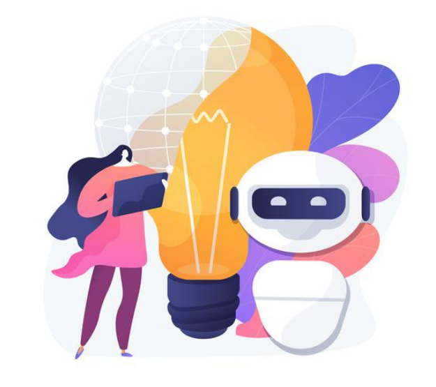

# TOKENOMICS
The UPLOADEA Token UPL is created by the UPLOADEA team. It is a unit of value that is utilized as an alternative payment method that we employ to govern our business model and enable our users to interact with our products while promoting the dissemination and sharing of bonuses and privileges to all of its stakeholders. The Advantage – Users of UPLOADEA who own UPL tokens will enjoy the benefit of using products from within the application (cloud storage and computing), to subscribe to our MEGA plans and access an unlimited spectrum of data storage. Easy Access Most times credit cards are been declined due to location barriers but with the acquisition of the UPL token, users can swiftly and seamlessly purchase data storage notwithstanding the region from which the user resides. Tokenomics UPL UPL TOKEN Whitepaper uploadea.com 22 Tokenomics Security and Assurance - Trust and confidentiality of private details like the credit card information have been a major hindrance to why users do not make good purchases online but with the acquisition of the UPL token, you can make those purchases without any single fear or doubt. As a Value for Exchange - A token is also a unit of value, which can be exchanged from one person to another (UPL token exchanges), creating a transactional economy between sellers and buyers. Users can acquire token and also use this token as a medium of exchange at a later time. UPL Token will also be used by clients outside UPLOADEA Cloud Storage. The UPL token will have a fixed exchange rate set by the community. All products, services, and donations from the UPLOADEA system will be obtainable with the UPLOADEA token. More specifically, users who own a larger amount of the UPLOADEA token UPL will be given attractive bonuses as they continue in their subsequent patronage in upload hot cloud storage.

# WHY TO CHOOSE UPL TOKEN?
## DECENTRALIZED PLATFORM OF UPL
In contrast to the traditional centralized financial system, the UPL Token has brought decentralized finance features of cryptocurrency. Its ERC20 technology enables financial transactions without the involvement of anyone. Its peer-to-peer decentralized platform will certainly please its investors.

  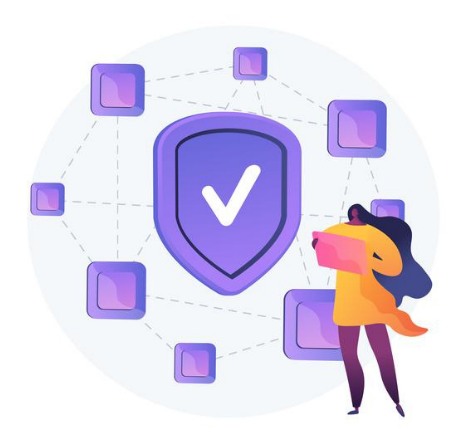

## FULL TRANSPARENCY OF UPL TOKEN
As no party, no bank, and no other agency is involved in the transaction process of the tokens so the finance system is surely transparent and is based upon the ERC20 technology which will certainly make its customer financially strong with transparent methods.

  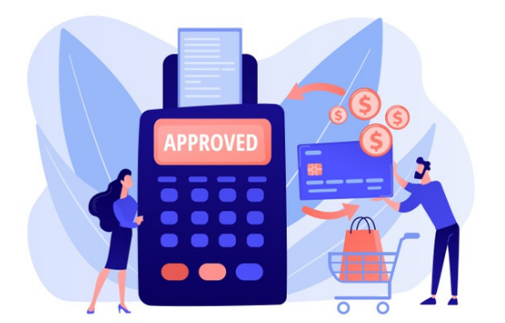

## FAST AND SECURE

This is also a key and distinctive feature of UPL Token that it will not let its investors down and will never create any chance of investor insecurity. The fastness of its level achievements and also the fastness of its provision of different and multipurpose utilities will also make it a revolutionary concept of cryptocurrencies.

## MULTIPURPOSE UTILITY OF UPL TOKEN TOKEN
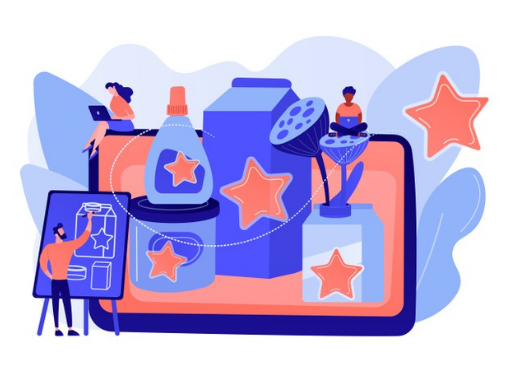
It is an awesome, distinctive, and wonderful planning of the UPL Token team that its tokens can easily be used for different purposes. They can easily be used for the playing of online games, for different types of entertainment activities, for different types of online shopping, and even thousands of online products would be purchased with the help of these tokens.

## MAXIMUM BUYING LIMIT

The credit goes to UPL Token that it does not make its program limited rather it is going to maximize its program of investment in order to give maximum advantages and financial benefits to the investors and trust builders of the project.

## THE LOGIC OF TOKEN BURNING
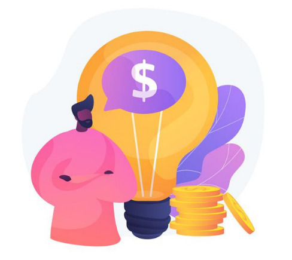
At a certain stage, the tokens of the UPL Token will get burnt, and at the burning stage there will be maximum benefits for the investors. This stage of logical token burning will certainly please the investors and will fill their pockets with maximum benefits.

## NOTABLE FEATURES OF UPL TOKEN
### Javawallet
JavaWallet is a mnemonic-based highly secured mobile wallet to store crypto assets. UPL token is free of charge transfer from Javawallet to Javawallet.

  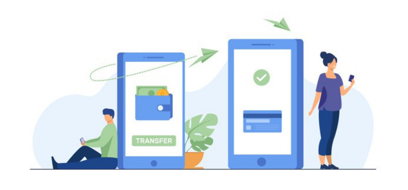

### Uploadea Virtual VISA Card
Uploadea Virtual VISA Card launching by 1st May 2021 and And you can easily pay with it.

  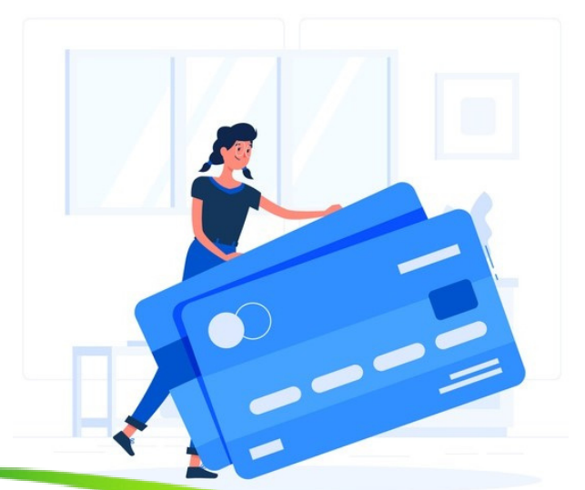

# TOKEN DISTRIBUTION PLAN

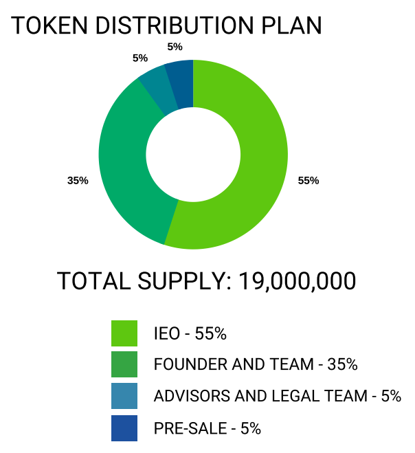

# ROADMAP OF UPLOADEA

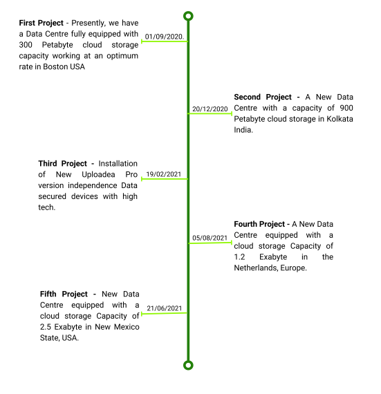

# MARKET STRATEGY
Uploadea have selected uncommon marketing approaches
## WEBSITE
The Uploadea website is a licensed website with customized hallmarks for all clients to use which shows up-to-date information regarding Uploadea cloud storage and token performance.

## REFERRAL REWARDS
Reference is an integral, essential, and the most important part of the planning of Uploadea becauseUploadea is trying to render maximum financial services for those who trust its project and also refer it to their near ones and strive to secure their future through the project.

## BRANDING

Uploadea will guarantee its uncommon approach is designed with the unique style in the digital space.

## PARTNERSHIP:

Uploadea has achieved good partnerships and will continue to partner with more companies to expand our market.

## PRESS PUBLICITY:
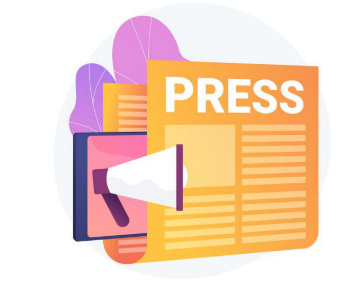
Uploadea will promote professional press publicity and blog postings for the marketing of its tokens. Press publicity will be featured on top cryptocurrency sites globally.

# CONCLUSION
Simple & Powerful Uploadea is Amazingly easy to Use where to Store Your Data & Save Your Countless Time. Uploadea cloud storage software provides online Data file Sync for Free and Paid Version. At Uploadea, Cloud Storage Backup is unlimited and Data Disaster Recovery. 
The UPL Token has brought decentralized smart tokens and these smart tokens are attached with ERC20 blockchain and these blockchains will certainly give maximum benefits and will also secure the investment of the investors of UPL Token. The project has distinctive, special, and outstanding features that belong to its planning of referral rewards, it's planning of Level rewards, it's planning of maximum buying limitations, it's planning of giving limitless selling freedom, and also its freedom of selling without any time limitation all are joining hands to make it the aptest and financial beneficial project of modern time. It's certainly on the road map and the planning is starting from Sep(2020) and going to complete in June(2021). it the most trustworthy project of Tokenization.

